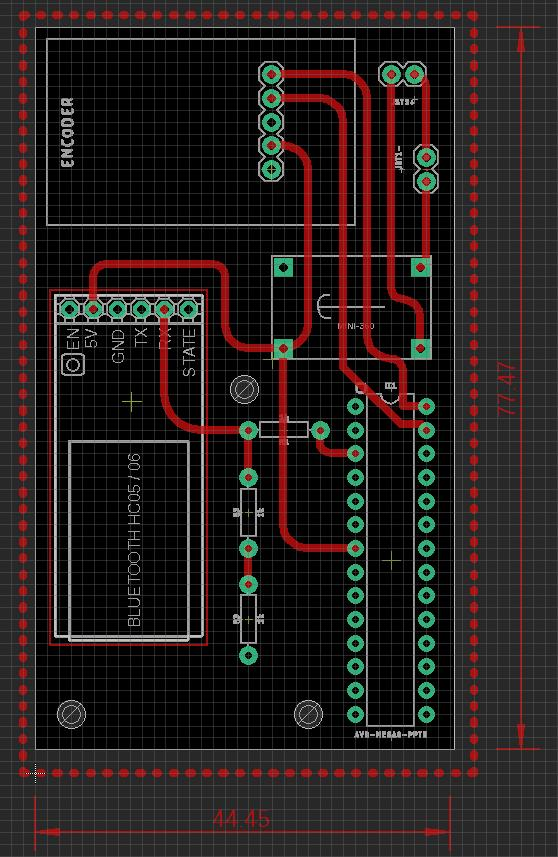

# Simple PDF/Web Scroller (Scroll)
A hobby project I worked on last year.
## Problem
Having to constantly reach for the laptop's touchpad to scroll through PDFs/Webpages while studying can be bothersome and interrupt concentration.

## Solution
This project offers a simple, custom-built hardware scroller to provide a more convenient way to navigate documents. It uses an Atmega8A microcontroller, a KY-040 rotary encoder for intuitive scrolling input, and an HC-05 Bluetooth module to wirelessly send scrolling data to a laptop. A Python script running on the laptop then receives this data and emulates mouse scrolling.

## Features
* **Physical Scrolling Knob:** Uses a KY-040 rotary encoder for tactile scroll control.
* **Wireless Operation:** Employs an HC-05 Bluetooth module for wireless communication with the laptop, eliminating extra cables.
* **DIY Electronics Project:** A fun project for those interested in AVR microcontrollers and custom input devices.

## Hardware Components
* **CPU:** Atmega8A Microcontroller
* **Input:** KY-040 Rotary Encoder
* **Wireless Communication:** HC-05 Bluetooth-to-Serial-Port Module

## How It Works
1.  The **KY-040 rotary encoder** detects rotational movement.
2.  The **Atmega8A microcontroller** reads the input from the rotary encoder.
3.  The Atmega8A processes this input and sends corresponding scroll commands (e.g., "scroll up" or "scroll down") serially.
4.  The **HC-05 Bluetooth module**, connected to the Atmega8A, transmits this serial data wirelessly to the paired laptop.
5.  A **Python script** running on the laptop listens for incoming data from the HC-05 Bluetooth connection.
6.  Upon receiving data, the Python script emulates mouse scroll actions (e.g., using a library like `pyautogui` or `pynput`).

## Software & Technologies
* **Microcontroller Programming:** Bare-Metal C for AVR (Atmega8A)
* **Laptop Scripting:** Python

## PCB
I'll be adding the pcb files (Eagle) later.
